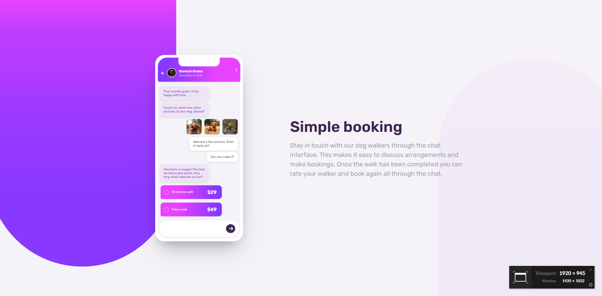

# Frontend Mentor - Chat app CSS illustration solution

This is a solution to the [Chat app CSS illustration challenge on Frontend Mentor](https://www.frontendmentor.io/challenges/chat-app-css-illustration-O5auMkFqY). Frontend Mentor challenges help you improve your coding skills by building realistic projects. 

## Table of contents

- [Overview](#overview)
  - [The challenge](#the-challenge)
  - [Screenshot](#screenshot)
  - [Links](#links)
- [My process](#my-process)
  - [Built with](#built-with)
- [Author](#author)

## Overview

### The challenge

Users should be able to:

- View the optimal layout for the component depending on their device's screen size
- **Bonus**: See the chat interface animate on the initial load

### Screenshot

### Links

- Solution URL: [Solution URL here](https://github.com/Gerson77/Chat-app-CSS-illustration)
- Live Site URL: [Live site URL here](https://chat-app-css-illustration-eight-rho.vercel.app/)

## My process

### Built with

- Semantic HTML5 markup
- CSS custom properties
- Flexbox
- Mobile-first workflow
- Animation [GSAP](https://gsap.com/)

## Author
- Website - [Portifolio](https://portifolio-puce-theta-49.vercel.app/)
- Frontend Mentor - [@Gerson77](https://www.frontendmentor.io/profile/Gerson77)
- Linkedin - [@gerson-santos-silva](https://www.linkedin.com/in/gerson-santos-silva/)
